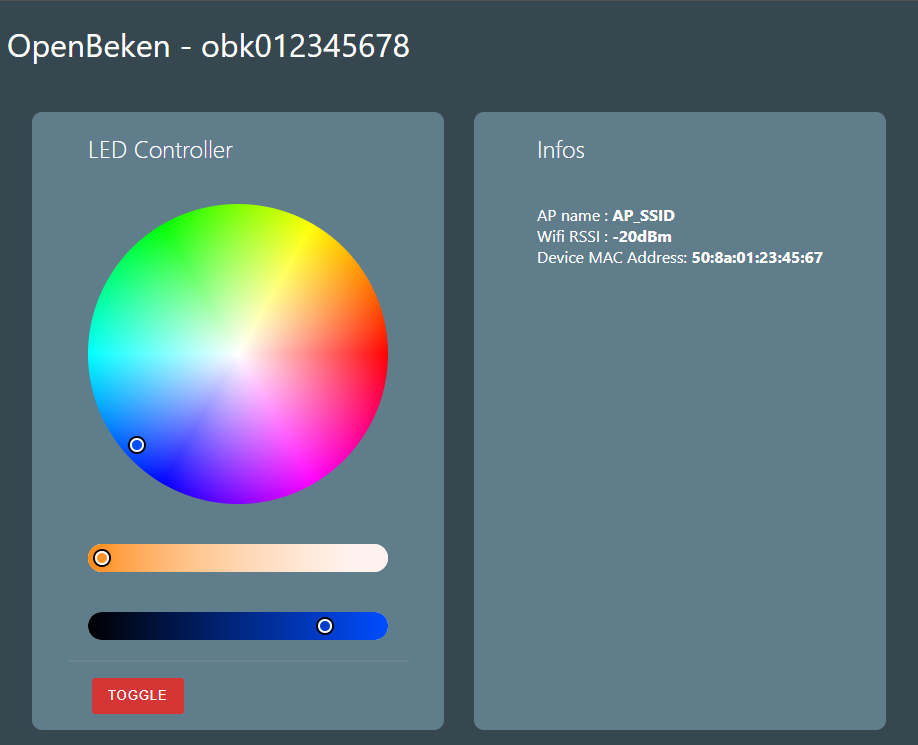

# RGBCW Bulb Controller

## About

Lightweight (6kb) embedded webpage to control RGBCW bulbs, stored on the bulb itself.



## Build

### Prerequisites

- ``OpenBeken`` installed and configured on the target device

- ``npm`` installed on the host machine to build the webpage

### Steps

1. Clone the repository
```bash	
git clone https://github.com/Nicolas-93/obk_rgbcw_webui
```

2. Build the webpage

```bash
cd obk_rgbcw_webui
npm init
npm run build
```

3. Copy generated content under ``dist`` folder to the target device, by using OpenBeken's webapp (``Filesystem`` tab).

4. Open the webpage by navigating to ``http://<bulb_ip>/api/lfs/index.html``
